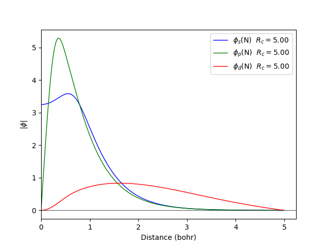
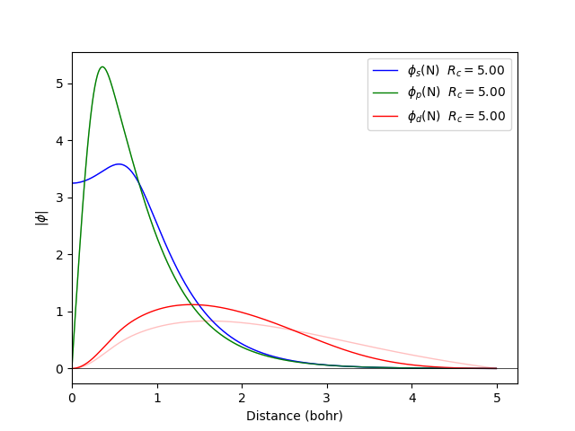
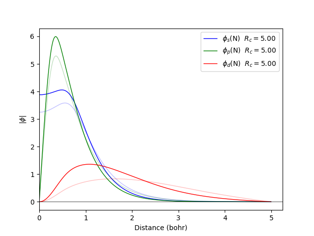

.. currentmodule:: fireballpy

.. _fdata:

What are FDatas?
================

In the previous section we ended by noting a download
that happened as we tried to compute the energies
for our example.
This download is requiered as we need what we call *FDatas*.

So, what is a *FData*? It is the collection of precomputed
integrals of the base functions which allow for massive
speed improvement as they do not need to be calculated every time.
In exchange, it does occupy space in the hard disk (few hundred MBs)
and requiere a download the first time they are used.
You can check what *FDatas* are available by using the
``available_fdatas()`` function.

Before moving further we should address the question:
"Are you downloading files into my computer?" Yes.
We aknowledge the posible security concerns which is why
we perform sha256sum checks to ensure nothing wrong
happens with the download.
We also ask before updating any *FData* and replacing files.
Nonetheless, this a good time as any to remind that no
script (ours or not) should **EVER** be executed with administrator
priviledges unless you place the utmost trust on it and it is strictly necessary.
To end with this discourse, you may check where these files
are downloaded with the ``get_fb_home()`` function.
The download path may be controlled with the environmental variable
``FIREBALL_HOME``. By default it will take the path
given by the environmental variable ``XDG_CACHE_HOME`` or
fallback to the Unix default ``~/.cache/``.

The next question one may have is what *FData* to use.
We have prepared a whole set of *FDatas* available
to be fetched from FireballPy.
Find a brief summary of them in the next table:

.. TODO table with FDatas

If you find that no *FData* may suit your need please feel free to contact us!

After this gentle introduction to the concept of *FDatas* is time to return
to coding and explore the nice things FireballPy can do!

Whow to do FDatas?
==================

If you want to construct an fdata, the first thing you need is the wavefunctions for the orbitals of the atoms you require and the pseudopotentials. The fdata command will automatically obtain them from `here <https://fireball-qmd.github.io/fireball.html#database-of-wave-function-and-pseudopotentials>`_.

If you want to generate the wavefunctions yourself, you can do so using the fdata command, which should have been installed when you installed fireballpy. For example, let's generate the (sp) orbitals for a Si atom:

.. code-block:: bash

  fdata wavefunctions --element N --orbitals spd -n 2.00 3.00 0.00 -r 5.00 5.00 5.00

We can compress the orbitals using a confining potential. In the following example, we will apply it only to the d orbital:

.. code-block:: bash

  fdata wavefunctions --element N --orbitals spd -n 2.00 3.00 0.00 -r 5.00 5.00 5.00 --vpot 0.00 0.00 20.00 --rpot 0.00 0.00 2.00

Another way to modify the shape of the orbitals is to generate them with less charge:

.. code-block:: bash

  fdata wavefunctions --element Si --orbitals spd -n 2.00 1.00 0.00 -r 5.00 5.00 5.00

Even though the atom remains neutral, meaning that the neutral atom and charged atom potentials (i.e., Hartree interactions) are generated. The neutral atom potential is determined from:

.. math::

   V_{NA} = V_{ion+} \int \frac{n_s |\Phi_s|^2 + n_p |\Phi_p|^2 + \cdots}{|r-r'|}

The charged atom potential is based on the wavefunction of the shell, so the piece for the s-shell is determined by:

.. math::

   V^s = \int \frac{|\Phi_s|^2}{|r-r'|}

These Hartree potentials are required for calculating Coulombic shell potentials when solving the one-electron Schrödinger equation.

.. math::

  \left(-\frac{\hbar}{2m}\nabla^2 + V_{ext}(\mathbf{r}) + \mu_{xc}[\rho_{in}(\mathbf{r})] + \frac{e^2}{2}\int \frac{\rho_{in}(r)}{|\mathbf{r}-\mathbf{r}'|} d^3r' \right) \psi_i(\mathbf{r}) = \epsilon_i \psi_i(\mathbf{r})

A set of slightly excited pseudo-atomic Fireball wavefunctions are computed within density-functional theory (using either the local-density approximation or generalized gradient corrections) and a norm-conserving separable pseudo-potential [fhi98PP]_. These wavefunctions are chosen such that they smoothly vanish at the cutoff radius. These pseudopotentials will also be downloaded automatically from here.

Another way to generate orbitals is by using the mixing factor...

References
----------

.. [fhi98PP]  M. Fuchs, M. Sheffler. "Ab initio pseudopotentials for electronic structure calculations of poly-atomic systems using density-functional theory," Comput. Phys. Comm., 119, 67-98 (1999). `https://doi.org/10.1016/S0010-4655(98)00201-X <https://www.sciencedirect.com/science/article/abs/pii/S001046559800201X>`_

